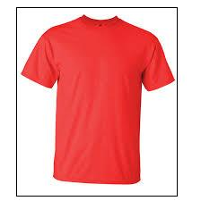
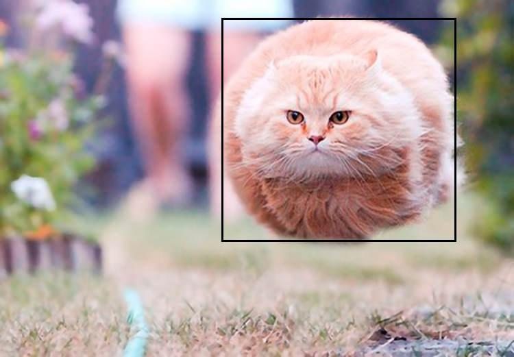

# TensorflowObjectDetectorJava

It's a demo Java client that can use <a href='https://github.com/tensorflow/models/tree/master/research/object_detection'>Tensorflow Object Detection API</a> 
which uses any of the pretrained models from <a href='https://github.com/tensorflow/models/blob/master/research/object_detection/g3doc/detection_model_zoo.md'>Tensorflow detection model zoo</a> 

Download and extract any of the models above and edit the path <a href='https://github.com/sumsuddin/TensorflowObjectDetectorJava/blob/64046bdf2adc65cc16ead989159b706f90a444c0/src/main/java/com/srgroup/tfobj/Main.java#L17'>here</a> 

Text file path containing labels in each line, edit the path <a href='https://github.com/sumsuddin/TensorflowObjectDetectorJava/blob/64046bdf2adc65cc16ead989159b706f90a444c0/src/main/java/com/srgroup/tfobj/Main.java#L18'>here</a> 

Input image path <a href='https://github.com/sumsuddin/TensorflowObjectDetectorJava/blob/64046bdf2adc65cc16ead989159b706f90a444c0/src/main/java/com/srgroup/tfobj/Main.java#L19'>here</a> 

I hope I will imporve the example and add segmentation and other demo codes later. :-)

  

  

  

  

